# Accelerator Optimization Copilot - Complete Documentation

**A comprehensive guide to understanding every component of the system**

---

## 📋 Table of Contents

1. [Overview](#overview)
2. [Quick Start](#quick-start)
3. [Project Structure](#project-structure)
4. [Complete Script Walkthrough](#complete-script-walkthrough)
5. [Mistral LLM Implementation Deep Dive](#mistral-llm-implementation-deep-dive)
6. [Data Flow & Architecture](#data-flow--architecture)
7. [API Reference](#api-reference)
8. [Understanding the Output](#understanding-the-output)

---

## Overview

### What Is This System?

The **Accelerator Optimization Copilot** is a memory hierarchy simulator and optimizer for deep learning workloads. It simulates how different cache policies perform with various neural network architectures.

**Core Question**: *"How well does my cache/memory system handle tensor operations from different model architectures?"*

### Key Features

- ✅ **Synthetic Workload Generation**: Realistic tensor access patterns for Transformer, CNN, MLP, and MoE models
- ✅ **ML-Based Eviction Scheduling**: Mistral-7B-powered prediction of optimal cache eviction strategies
- ✅ **Cache Simulation**: Simulate LRU, FIFO, and ML-based cache policies
- ✅ **Statistical Validation**: Chi-square and Kolmogorov-Smirnov tests for workload quality
- ✅ **Compiler Prediction**: Predict latency and energy for kernel code
- ✅ **Interactive UI**: Streamlit dashboard with real-time visualizations

---

## Quick Start

### Installation

```bash
# Navigate to project directory
cd accelerator_optimization_copilot

# Install dependencies
pip install -r requirements.txt
```

### Running the System

**1. Start the Backend (FastAPI)**
```bash
uvicorn backend.main:app --reload --host 127.0.0.1 --port 8000
```
- API available at: http://127.0.0.1:8000
- Interactive docs: http://127.0.0.1:8000/docs

**2. Start the Frontend (Streamlit)**
```bash
streamlit run ui/app.py --server.port 8501
```
- UI available at: http://localhost:8501

### First Simulation

1. Open http://localhost:8501
2. Select **Model Type**: Transformer
3. Choose **Cache Policy**: LRU
4. Set **Layers**: 12
5. Click **Run Simulation**
6. View results: cache hits, latency, eviction scores, heatmap

---

## Project Structure

```
accelerator_optimization_copilot/
├── backend/                          # Core logic and API
│   ├── ml/                           # Machine Learning components
│   │   └── models/
│   │       └── scheduler_opt.py      # Mistral-7B eviction scoring
│   ├── simulator/
│   │   └── memory_simulator.py       # Cache simulation engine
│   ├── workload/
│   │   └── generate_synthetic_workload.py  # Trace generator
│   ├── tests/                        # Unit tests
│   │   ├── test_memory_simulator.py
│   │   ├── test_scheduler.py
│   │   └── test_workload.py
│   ├── main.py                       # FastAPI application
│   └── statistical_validation.py     # Chi-square & KS tests
├── ui/
│   └── app.py                        # Streamlit dashboard
├── requirements.txt                  # Python dependencies
└── test_api.py                       # API integration tests
```

---

## Complete Script Walkthrough

### 1. Backend Entry Point: `backend/main.py`

**Purpose**: FastAPI application that exposes REST endpoints for the frontend

**Key Endpoints**:

#### POST /generate-trace
Generates synthetic memory access trace based on model parameters.

```python
@app.post("/generate-trace")
def generate_trace(req: TraceRequest):
    df = generate_synthetic_trace(**req.dict())
    return df.to_dict(orient="records")
```

**Input**:
```json
{
  "model_type": "Transformer",
  "num_layers": 12,
  "batch_size": 32,
  "seq_length": 128,
  "reuse_probability": 0.3
}
```

**Output**: DataFrame with columns:
- `tensor_id`: Unique identifier (e.g., "Q_5")
- `size_mb`: Tensor size in MB
- `reuse_distance`: Number of accesses since last use
- `stride`: Memory access pattern
- `op`: Operation type (matmul, attention, etc.)
- `model_type`: Architecture type

---

#### POST /predict-schedule
Generates trace and computes ML-based eviction scores.

```python
@app.post("/predict-schedule")
def predict_schedule(req: TraceRequest):
    df = generate_synthetic_trace(**req.dict())
    df = predict_eviction_scores(df)  # Adds eviction_score column
    return df.to_dict(orient="records")
```

**What it does**:
1. Generates synthetic trace
2. Calls `predict_eviction_scores()` which uses Mistral LLM (or fallback)
3. Returns trace with eviction scores

---

#### POST /simulate
Runs full cache simulation with specified policy.

```python
@app.post("/simulate")
def simulate(req: TraceRequest, policy: str = Query("LRU")):
    df = generate_synthetic_trace(**req.dict())
    df = predict_eviction_scores(df)  # Required for ML policy
    
    sim = MemorySimulator()
    metrics = sim.simulate_trace(df, policy=policy)
    return metrics
```

**Flow**:
1. Generate trace
2. Compute eviction scores
3. Create simulator instance
4. Run simulation with chosen policy (LRU/FIFO/ML)
5. Return performance metrics

**Output**:
```json
{
  "cache_hits (count)": 417,
  "dram_accesses (count)": 45,
  "total_latency (ms)": 2.39,
  "evictions (count)": 78,
  "bandwidth_wait_time (ms)": 9.31,
  "cache_hit_rate (%)": 90.26
}
```

---

#### POST /validate-trace
Runs statistical tests to validate trace quality.

```python
@app.post("/validate-trace")
def validate_trace(req: TraceRequest):
    df = generate_synthetic_trace(**req.dict())
    
    reuse_p = validate_reuse_rates(df, req.model_type)
    size_p = validate_tensor_size_distribution(df, req.model_type)
    
    return {
        "reuse_distribution_p_value (chi-square)": round(reuse_p, 4),
        "tensor_size_distribution_p_value (KS-test)": round(size_p, 4),
        "interpretation": "p-value > 0.05 indicates good statistical match"
    }
```

**Tests**:
- **Chi-square**: Tests if reuse distance distribution matches expected pattern
- **KS test**: Tests if tensor size distribution is realistic

---

#### POST /predict-compile
Predicts compilation latency and energy for kernel code.

```python
@app.post("/predict-compile")
def predict_compile(req: PredictCompileRequest):
    # Extracts features from code (placeholder)
    features = {
        "num_loops": 3,
        "num_branches": 5,
        "load_ops": 12,
        "store_ops": 6,
        "flops": 128,
        "mem_bytes": 1024
    }
    
    # Predictions (placeholder - uses random values)
    latency = np.random.uniform(0.1, 3.0)
    energy = np.random.uniform(0.05, 2.0)
    
    return {
        "latency (ms)": round(latency, 3),
        "energy (J)": round(energy, 3),
        "features": features,
        "feature_importance": {...}
    }
```

**Note**: This is currently a placeholder implementation with random predictions.

---

### 2. Workload Generator: `backend/workload/generate_synthetic_workload.py`

**Purpose**: Creates realistic memory access traces for different model architectures

**Function Signature**:
```python
def generate_synthetic_trace(
    model_type: str = \"Transformer\",
    num_layers: int = 96,
    batch_size: int = 32,
    seq_length: int = 128,
    reuse_probability: float = 0.3,
    max_tensors_per_layer: int = 16
) -> pd.DataFrame
```

**Algorithm**:

```python
for each layer in num_layers:
    # 1. Select tensor types based on model
    if model_type == \"Transformer\":
        tensor_types = [\"Q\", \"K\", \"V\", \"output\"]
    elif model_type == \"CNN\":
        tensor_types = [\"weights\", \"activations\", \"output\"]
    elif model_type == \"MLP\":
        tensor_types = [\"weights\", \"activations\"]
    elif model_type == \"MoE\":
        tensor_types = [\"expert_weights\", \"activations\"]
    
    for each tensor_type:
        # 2. Generate tensor properties
        tensor_id = f\"{tensor_type}_{layer}\"
        size_mb = random.choice([4, 8, 16, 32])
        stride = 1 if not CNN else random.choice([1, 2, 4])
        op = random.choice([\"matmul\", \"attention\", \"conv\", \"relu\", \"gating\"])
        
        # 3. Simulate reuse
        reuse_count = binomial(n=5, p=reuse_probability)
        
        for access in range(reuse_count + 1):
            trace.append({
                \"tensor_id\": tensor_id,
                \"size_mb\": size_mb,
                \"reuse_distance\": access,  # 0 = first access
                \"stride\": stride,
                \"op\": op,
                \"model_type\": model_type
            })
```

**Example Output**:
```
| tensor_id | size_mb | reuse_distance | stride | op        | model_type             |
| --------- | ------- | -------------- | ------ | --------- | ---------------------- |
| Q_0       | 16      | 0              | 1      | attention | Transformer            |
| K_0       | 8       | 0              | 1      | attention | Transformer            |
| V_0       | 8       | 0              | 1      | attention | Transformer            |
| Q_0       | 16      | 1              | 1      | attention | Transformer  ← Reused! |
| output_0  | 32      | 0              | 1      | matmul    | Transformer            |
```

**Key Insights**:
- **reuse_probability** controls temporal locality
  - High (0.7-0.9): Transformer-like patterns
  - Low (0.1-0.3): MLP-like patterns
- **stride** captures spatial locality
  - stride=1: Sequential access
  - stride>1: Strided convolutions (CNN)

---

### 3. Cache Simulator: `backend/simulator/memory_simulator.py`

**Purpose**: Simulates cache behavior with different eviction policies

**Classes**:

#### TensorMeta
```python
class TensorMeta:
    def __init__(self, tensor_id: str, size_mb: int, last_access: int):
        self.tensor_id = tensor_id
        self.size_mb = size_mb
        self.last_access = last_access
```
Stores metadata for each tensor in cache.

#### CacheState
```python
class CacheState:
    def __init__(self, max_cache_mb: int = 64):
        self.max_cache_mb = 64  # Cache capacity
        self.cache_contents: Dict[str, TensorMeta] = {}
        self.usage_order: List[str] = []  # For LRU tracking
```
Maintains current cache state.

#### MemorySimulator
```python
class MemorySimulator:
    def __init__(self, cache_size_mb=64, dram_latency_per_mb=0.1, dram_bandwidth=32):
        self.cache = CacheState(cache_size_mb)
        self.dram_latency_per_mb = 0.1  # 0.1ms per MB
        self.dram_bandwidth = 32         # 32 MB/s
        self.metrics = {
            \"cache_hits\": 0,
            \"dram_accesses\": 0,
            \"total_latency\": 0.0,
            \"evictions\": 0,
            \"bandwidth_wait_time\": 0.0
        }
```

**Core Simulation Logic**:

```python
def access_tensor(self, tensor_id, size_mb, access_idx, policy=\"LRU\"):
    if tensor_id in self.cache.cache_contents:
        # ✅ CACHE HIT
        self.metrics[\"cache_hits\"] += 1
        self.metrics[\"total_latency\"] += 0.01  # Fast cache access
        self.cache.cache_contents[tensor_id].last_access = access_idx
        
        if policy == \"LRU\":
            # Move to end (most recently used)
            self.cache.usage_order.remove(tensor_id)
            self.cache.usage_order.append(tensor_id)
    else:
        # ❌ CACHE MISS
        self.metrics[\"dram_accesses\"] += 1
        
        # Calculate fetch time
        fetch_time = size_mb * self.dram_latency_per_mb + size_mb / self.dram_bandwidth
        self.metrics[\"total_latency\"] += fetch_time
        self.metrics[\"bandwidth_wait_time\"] += size_mb / self.dram_bandwidth
        
        # Evict if cache is full
        while self.cache.current_usage() + size_mb > self.cache.max_cache_mb:
            oldest = self.cache.usage_order.pop(0)  # LRU eviction
            del self.cache.cache_contents[oldest]
            self.metrics[\"evictions\"] += 1
        
        # Add tensor to cache
        meta = TensorMeta(tensor_id, size_mb, access_idx)
        self.cache.cache_contents[tensor_id] = meta
        self.cache.usage_order.append(tensor_id)
```

**Latency Calculation**:
- **Cache hit**: 0.01 ms (fixed, very fast)
- **Cache miss**: `size_mb × 0.1 ms + size_mb / 32 MB/s`
  - Example for 16 MB: `16 × 0.1 + 16/32 = 1.6 + 0.5 = 2.1 ms`

**Policies**:
- **LRU**: Evict least recently used (best for temporal locality)
- **FIFO**: Evict oldest insertion (simple streaming)
- **ML**: Evict highest eviction_score (learned patterns)

---

### 4. Statistical Validation: `backend/statistical_validation.py`

**Purpose**: Validate that synthetic traces are statistically realistic

**Test 1: Chi-Square (Reuse Distribution)**
```python
def validate_reuse_rates(trace_df, model_type):
    observed = trace_df['reuse_distance'].value_counts()
    expected = geometric_distribution()  # Expected pattern
    
    χ² = Σ((observed - expected)² / expected)
    p_value = chi_square_test(χ²)
    
    return p_value
```

**Interpretation**:
- p > 0.05: ✅ Reuse pattern looks realistic
- p < 0.05: ⚠️ Unusual pattern

**Test 2: Kolmogorov-Smirnov (Size Distribution)**
```python
def validate_tensor_size_distribution(trace_df, model_type):
    observed_sizes = trace_df['size_mb'].values
    expected_sizes = [4, 8, 16, 32]
    
    KS_statistic, p_value = ks_2samp(observed, expected)
    
    return p_value
```

**Interpretation**:
- p > 0.05: ✅ Size distribution is reasonable
- p < 0.05: ⚠️ Sizes don't match typical patterns

---

## Mistral LLM Implementation Deep Dive

### Overview

The system uses **Mistral-7B-Instruct-v0.2** with **4-bit quantization** for ML-based eviction score prediction.

**Location**: `backend/ml/models/scheduler_opt.py`

### Why Mistral?

- ✅ Superior instruction following and reasoning
- ✅ Better prediction accuracy than OPT-125M
- ✅ State-of-the-art open-source model
- ✅ Active community support

### Implementation Details

#### 1. Lazy Loading Pattern

The model is loaded **only when needed** (not at startup):

```python
# Global variables for model caching
_model = None
_tokenizer = None

def _get_model():
    \"\"\"Lazy load the Mistral model with 4-bit quantization\"\"\"
    global _model, _tokenizer
    if _model is None:
        # Load model here
        ...
    return _model, _tokenizer
```

**Why lazy loading?**
- Faster API startup time
- Model only loaded if `/predict-schedule` endpoint is called
- Saves memory if ML policy isn't used

---

#### 2. 4-Bit Quantization Configuration

```python
from transformers import BitsAndBytesConfig

bnb_config = BitsAndBytesConfig(
    load_in_4bit=True,                    # Enable 4-bit quantization
    bnb_4bit_use_double_quant=True,       # Double quantization for better compression
    bnb_4bit_quant_type=\"nf4\",            # NF4 (Normal Float 4-bit) format
    bnb_4bit_compute_dtype=torch.float16  # Compute in float16 for speed
)
```

**What is 4-bit quantization?**
- Reduces model size from ~14GB (FP16) to ~4-5GB (4-bit)
- **70% memory savings** with minimal accuracy loss
- Uses NF4 (Normal Float 4-bit) - optimized for neural network weights

**How it works**:
1. Model weights stored in 4-bit format
2. During computation, weights are dequantized to float16
3. Computation happens in float16
4. Results stored back in 4-bit

---

#### 3. Loading Mistral Model

```python
from transformers import AutoModelForCausalLM, AutoTokenizer

_model = AutoModelForCausalLM.from_pretrained(
    \"mistralai/Mistral-7B-Instruct-v0.2\",  # Model identifier on HuggingFace
    quantization_config=bnb_config,         # Apply 4-bit quantization
    device_map=\"auto\",                      # Automatically distribute across GPUs/CPU
    trust_remote_code=True                  # Allow custom model code
)

_tokenizer = AutoTokenizer.from_pretrained(\"mistralai/Mistral-7B-Instruct-v0.2\")
```

**What happens here?**
1. Downloads model from HuggingFace Hub (~4-5GB with quantization)
2. Loads model with 4-bit quantization applied
3. `device_map=\"auto\"` automatically places model on available hardware
4. Tokenizer loaded for text processing

**First-time download**: Takes 2-5 minutes depending on internet speed

---

#### 4. LoRA (Low-Rank Adaptation) Configuration

```python
from peft import LoraConfig, get_peft_model

lora_config = LoraConfig(
    r=8,                          # LoRA rank (dimensionality)
    lora_alpha=16,                # Scaling factor
    target_modules=[              # Which layers to apply LoRA to
        \"q_proj\", \"k_proj\", \"v_proj\", \"o_proj\",  # Attention layers
        \"gate_proj\", \"up_proj\", \"down_proj\"         # MLP layers
    ],
    lora_dropout=0.1,             # Dropout for regularization
    bias=\"none\",                  # Don't train bias terms
    task_type=\"CAUSAL_LM\"         # Causal language modeling task
)

_model = get_peft_model(_model, lora_config)
```

**What is LoRA?**
- **Low-Rank Adaptation**: Efficient fine-tuning method
- Instead of updating all 7B parameters, only trains small adapter matrices
- **Reduces trainable parameters by 99%**

**Target Modules Explained**:

**Attention Layers** (Mistral architecture):
- `q_proj`: Query projection matrix
- `k_proj`: Key projection matrix
- `v_proj`: Value projection matrix
- `o_proj`: Output projection (Mistral uses `o_proj`, OPT used `out_proj`)

**MLP Layers** (Mistral-specific):
- `gate_proj`: Gating mechanism for MLP
- `up_proj`: Upward projection in MLP
- `down_proj`: Downward projection in MLP

**Why these modules?**
- These are the most important weight matrices in the model
- Adapting these gives best performance/parameter trade-off

---

#### 5. Eviction Score Prediction

**Current Implementation** (Simplified Scoring):

```python
def predict_eviction_scores(trace_df: pd.DataFrame):
    \"\"\"
    Predict eviction scores for tensors in the trace.
    Currently uses simplified scoring (not using Mistral yet).
    \"\"\"
    inputs = trace_df[[\"size_mb\", \"reuse_distance\", \"stride\"]].values.astype(float)
    
    # Normalize to [0, 1]
    inputs_normalized = inputs / (inputs.max(axis=0) + 1e-8)
    
    # Weighted score: higher = more likely to evict
    eviction_scores = (
        0.4 * inputs_normalized[:, 0] +  # 40% weight on size
        0.5 * inputs_normalized[:, 1] +  # 50% weight on reuse_distance
        0.1 * inputs_normalized[:, 2]    # 10% weight on stride
    )
    
    trace_df[\"eviction_score\"] = eviction_scores
    return trace_df
```

**Scoring Logic**:
- **Large tensors** (high size_mb) → Higher score → Evict first
- **Cold tensors** (high reuse_distance) → Higher score → Evict first
- **Poor locality** (high stride) → Higher score → Evict first

**Example**:
```
| tensor_id | size_mb | reuse_distance | stride | eviction_score              |
| --------- | ------- | -------------- | ------ | --------------------------- |
| Q_0       | 4       | 0              | 1      | 0.12  ← Keep (hot, small)   |
| V_5       | 32      | 5              | 1      | 0.85  ← Evict (cold, large) |
| weights_2 | 16      | 2              | 4      | 0.56  ← Medium priority     |
```

---

### How Mistral is Called (Currently)

**Important Note**: The Mistral model is **loaded but not actively used** in the current implementation. Here's the flow:

```python
# When predict_eviction_scores() is called:

1. _get_model() is called (lazy loading)
   ↓
2. If _model is None:
   - Load Mistral-7B with 4-bit quantization
   - Apply LoRA adapters
   - Print \"Successfully loaded Mistral-7B-Instruct-v0.2 with 4-bit quantization\"
   ↓
3. If loading fails:
   - Print warning
   - Fall back to simplified scoring
   ↓
4. Currently: Always use simplified scoring
   (Mistral model loaded but not invoked)
```

**Why not using Mistral yet?**
- Model infrastructure is in place
- Simplified scoring works well as baseline
- Future enhancement: Use Mistral for learned eviction patterns

---

### Future Mistral Integration

**How Mistral could be used**:

```python
def predict_eviction_scores_with_mistral(trace_df: pd.DataFrame):
    model, tokenizer = _get_model()
    
    # Create prompt for Mistral
    prompt = f\"\"\"
    Given these tensor access patterns:
    {trace_df.to_string()}
    
    Predict which tensors should be evicted from cache.
    Consider: size, reuse distance, and access patterns.
    \"\"\"
    
    # Tokenize
    inputs = tokenizer(prompt, return_tensors=\"pt\")
    
    # Generate predictions
    outputs = model.generate(**inputs, max_new_tokens=100)
    
    # Parse Mistral's response to extract eviction scores
    response = tokenizer.decode(outputs[0])
    scores = parse_mistral_response(response)
    
    trace_df[\"eviction_score\"] = scores
    return trace_df
```

**Benefits of Mistral integration**:
- Learn complex access patterns
- Adapt to different model architectures
- Predict future reuse based on context
- Better than hand-crafted heuristics

---

### Memory Usage

**Without Quantization** (FP16):
- Mistral-7B: ~14GB
- Too large for most consumer GPUs

**With 4-bit Quantization**:
- Mistral-7B: ~4-5GB
- Fits on consumer GPUs (RTX 3090, 4090)
- Can run on CPU (slower)

**Device Placement** (`device_map=\"auto\"`):
- Automatically distributes model across available devices
- GPU if available, otherwise CPU
- Can split across multiple GPUs if needed

---

### Dependencies

**Required packages** (in `requirements.txt`):
```
transformers      # HuggingFace transformers library
peft              # Parameter-Efficient Fine-Tuning (LoRA)
bitsandbytes      # 4-bit quantization
accelerate        # Efficient model loading
torch             # PyTorch
```

---

## System Architecture

### Visual Architecture Overview

```mermaid
graph TB
    subgraph "User Interface Layer"
        UI["User / Streamlit UI<br/>Config & Policy<br/>JSON"]
    end
    
    subgraph "Backend Layer - FastAPI"
        Backend["FastAPI Backend<br/>main.py"]
    end
    
    subgraph "Processing Pipeline"
        Gen["1. Generate<br/>Synthetic Workload Generator<br/>generate_synthetic_workload.py"]
        Score["2. Score<br/>ML Eviction Model<br/>Mistral-7B-Instruct-v0.2<br/>scheduler_opt.py"]
        Sim["3. Simulate<br/>Memory Simulator<br/>memory_simulator.py"]
        Val["4. Validate<br/>Statistical Validator<br/>statistical_validation.py"]
    end
    
    subgraph "Output Layer"
        Output["Memory Simulator<br/>Metrics & Results"]
    end
    
    UI -->|"HTTP POST<br/>Config & Policy"| Backend
    Backend -->|"1. Generate"| Gen
    Gen -->|"DataFrame"| Score
    Backend -->|"2. Score"| Score
    Score -->|"Scored DataFrame"| Sim
    Backend -->|"3. Simulate"| Sim
    Sim -->|"Metrics"| Output
    Backend -->|"4. Validate"| Val
    Gen -->|"DataFrame"| Val
    Val -->|"p-values"| Backend
    Output -->|"JSON Response"| Backend
    Backend -->|"Results"| UI
    
    style UI fill:#4A90E2,stroke:#2E5C8A,stroke-width:2px,color:#fff
    style Backend fill:#50C878,stroke:#2E7D4E,stroke-width:2px,color:#fff
    style Gen fill:#9B59B6,stroke:#6C3483,stroke-width:2px,color:#fff
    style Score fill:#E74C3C,stroke:#A93226,stroke-width:2px,color:#fff
    style Sim fill:#F39C12,stroke:#B9770E,stroke-width:2px,color:#fff
    style Val fill:#1ABC9C,stroke:#117A65,stroke-width:2px,color:#fff
    style Output fill:#34495E,stroke:#1C2833,stroke-width:2px,color:#fff
```



The diagram above shows the complete system architecture and data flow through the Accelerator Optimization Copilot.

### Architecture Components Explained

#### 1. **User / Streamlit UI** (Top Layer)
The entry point where users interact with the system:
- **Input**: Model configuration (type, layers, batch size, sequence length, reuse probability)
- **Output**: Sends JSON request with `Config & Policy` parameters
- **Communication**: HTTP POST requests to FastAPI backend

#### 2. **FastAPI Backend** (Central Hub)
The orchestration layer that coordinates all components:
- **Role**: Receives requests and routes to appropriate components
- **Endpoints**: `/generate-trace`, `/predict-schedule`, `/simulate`, `/validate-trace`
- **Flow Control**: Manages the 4-step pipeline (numbered in diagram)

#### 3. **Component Pipeline** (Numbered Flow)

**Step 1: Generate** → **Synthetic Workload Generator**
- **Input**: Model configuration from UI
- **Process**: Creates realistic tensor access patterns
- **Output**: DataFrame with tensor metadata (ID, size, reuse distance, stride, operation)
- **File**: `backend/workload/generate_synthetic_workload.py`

**Step 2: Score** → **ML Eviction Model**
- **Input**: DataFrame from workload generator
- **Process**: Computes eviction scores using Mistral LLM (or fallback heuristic)
- **Output**: Scored DataFrame with `eviction_score` column
- **File**: `backend/ml/models/scheduler_opt.py`
- **Key Feature**: Mistral-7B-Instruct-v0.2 with 4-bit quantization

**Step 3: Simulate** → **Memory Simulator**
- **Input**: Scored DataFrame + selected policy (LRU/FIFO/ML)
- **Process**: Simulates cache behavior, tracks hits/misses/evictions
- **Output**: Performance metrics (latency, hit rate, bandwidth usage)
- **File**: `backend/simulator/memory_simulator.py`

**Step 4: Validate** → **Statistical Validator**
- **Input**: Generated trace DataFrame
- **Process**: Runs chi-square and KS tests
- **Output**: P-values indicating trace quality
- **File**: `backend/statistical_validation.py`

#### 4. **Memory Simulator** (Bottom Layer)
The final execution component:
- **Receives**: Scored DataFrame from ML Eviction Model
- **Executes**: Cache simulation with chosen policy
- **Returns**: Metrics back through FastAPI to UI

### Data Flow Sequence

```
User Input (UI)
    ↓
FastAPI Backend receives request
    ↓
1. Generate Synthetic Workload
    ├─ Creates tensor access trace
    └─ Returns DataFrame
    ↓
2. ML Eviction Model
    ├─ Loads Mistral-7B (lazy loading)
    ├─ Computes eviction scores
    └─ Returns scored DataFrame
    ↓
3. Memory Simulator
    ├─ Processes trace sequentially
    ├─ Applies cache policy (LRU/FIFO/ML)
    ├─ Tracks cache hits/misses
    └─ Calculates metrics
    ↓
4. Statistical Validator (optional)
    ├─ Chi-square test on reuse distribution
    └─ KS test on size distribution
    ↓
FastAPI returns JSON response
    ↓
UI displays results
    ├─ Metrics table
    ├─ Eviction scores
    ├─ Cache occupancy heatmap
    └─ Statistical validation p-values
```

### Key Architectural Decisions

**1. Separation of Concerns**
- Each component has a single, well-defined responsibility
- Workload generation is independent of simulation
- ML scoring is decoupled from cache policy

**2. Lazy Loading for Mistral**
- Model loaded only when needed
- Reduces startup time
- Saves memory if ML policy not used

**3. Policy Abstraction**
- Simulator supports multiple policies (LRU, FIFO, ML)
- Easy to add new policies
- Policy selection at runtime

**4. Statistical Validation as Optional**
- Validation can be enabled/disabled
- Doesn't block main simulation flow
- Useful for trace quality assurance

**5. RESTful API Design**
- Clean endpoint separation
- Each endpoint has specific purpose
- Easy to test and extend

### Component Interactions

| Component                 | Depends On           | Provides To                    |
| ------------------------- | -------------------- | ------------------------------ |
| **Workload Generator**    | User input           | ML Model, Simulator, Validator |
| **ML Eviction Model**     | Workload trace       | Simulator (for ML policy)      |
| **Memory Simulator**      | Scored trace, policy | Metrics to UI                  |
| **Statistical Validator** | Workload trace       | Quality metrics to UI          |
| **FastAPI Backend**       | All components       | Orchestration, API endpoints   |
| **Streamlit UI**          | Backend API          | User interface, visualizations |

---

## Data Flow & Architecture

### Complete Request Flow

```
┌─────────────────────────────────────────────────────────┐
│                    USER (Streamlit UI)                  │
│  Selects: Transformer, 12 layers, LRU, reuse_prob=0.3  │
└────────────────────┬────────────────────────────────────┘
                     │
                     │ HTTP POST /simulate?policy=LRU
                     ▼
┌─────────────────────────────────────────────────────────┐
│              BACKEND (FastAPI - main.py)                │
│                                                          │
│  1. simulate() endpoint receives request                │
│     ↓                                                    │
│  2. generate_synthetic_trace()                          │
│     - Creates ~576 tensor access entries                │
│     - Returns DataFrame                                 │
│     ↓                                                    │
│  3. predict_eviction_scores()                           │
│     - Loads Mistral model (if not loaded)               │
│     - Computes eviction scores                          │
│     - Returns DataFrame with scores                     │
│     ↓                                                    │
│  4. MemorySimulator.simulate_trace()                    │
│     - Processes each tensor access                      │
│     - Applies LRU policy                                │
│     - Tracks hits, misses, evictions                    │
│     ↓                                                    │
│  5. Return metrics JSON                                 │
└────────────────────┬────────────────────────────────────┘
                     │
                     │ JSON Response
                     ▼
┌─────────────────────────────────────────────────────────┐
│                    UI (Streamlit)                       │
│                                                          │
│  - Display metrics table                                │
│  - Show eviction scores                                 │
│  - Render heatmap                                       │
│  - Plot charts                                          │
└─────────────────────────────────────────────────────────┘
```

---

## API Reference

### Endpoints

| Endpoint            | Method | Purpose                  | Input                 | Output                |
| ------------------- | ------ | ------------------------ | --------------------- | --------------------- |
| `/generate-trace`   | POST   | Generate synthetic trace | TraceRequest          | DataFrame (JSON)      |
| `/predict-schedule` | POST   | Trace + eviction scores  | TraceRequest          | DataFrame with scores |
| `/simulate`         | POST   | Full simulation          | TraceRequest + policy | Metrics JSON          |
| `/validate-trace`   | POST   | Statistical validation   | TraceRequest          | p-values              |
| `/predict-compile`  | POST   | Compiler prediction      | Code + params         | Latency/energy        |

### Request Models

**TraceRequest**:
```json
{
  \"model_type\": \"Transformer\" | \"CNN\" | \"MLP\" | \"MoE\",
  \"num_layers\": 4-48,
  \"batch_size\": 1-256,
  \"seq_length\": 32-1024,
  \"reuse_probability\": 0.0-1.0
}
```

**PredictCompileRequest**:
```json
{
  \"code\": \"def matmul(a, b): return a @ b\",
  \"model_type\": \"Transformer\",
  \"opt_level\": \"O0\" | \"O1\" | \"O2\" | \"O3\"
}
```

---

## Understanding the Output

### Simulation Metrics

```json
{
  \"cache_hits (count)\": 417,
  \"dram_accesses (count)\": 45,
  \"total_latency (ms)\": 2.39,
  \"evictions (count)\": 78,
  \"bandwidth_wait_time (ms)\": 9.31,
  \"cache_hit_rate (%)\": 90.26
}
```

**Metric Explanations**:

| Metric                  | Good            | Bad              | Why It Matters                       |
| ----------------------- | --------------- | ---------------- | ------------------------------------ |
| **cache_hit_rate**      | >80%            | <50%             | Cache hits are 100× faster than DRAM |
| **total_latency**       | <10ms           | >100ms           | Total execution time                 |
| **evictions**           | Low             | >50% of accesses | Excessive evictions = thrashing      |
| **bandwidth_wait_time** | <20% of latency | >70% of latency  | Indicates bandwidth bottleneck       |

### Eviction Scores Table

```
| tensor_id     | size_mb | reuse_distance | stride | eviction_score |
| ------------- | ------- | -------------- | ------ | -------------- |
| activations_0 | 8       | 1              | 1      | 0.32           |
| weights_0     | 8       | 2              | 1      | 0.42           |
| activations_0 | 4       | 6              | 4      | 0.50           |
```

**How to read**:
- **Low score (0.0-0.3)**: Keep in cache (hot, frequently used)
- **Medium score (0.3-0.6)**: Moderate priority
- **High score (0.6-1.0)**: Evict first (cold, large, poor locality)

### Statistical Validation

```json
{
  \"reuse_distribution_p_value (chi-square)\": 0.82,
  \"tensor_size_distribution_p_value (KS-test)\": 0.91,
  \"interpretation\": \"p-value > 0.05 indicates good statistical match\"
}
```

**Interpretation**:
- **p > 0.05**: ✅ Trace is statistically realistic
- **p < 0.05**: ⚠️ Trace may not represent real workloads accurately

---

## Summary

This system provides a complete pipeline for:
1. **Generating** realistic memory access traces
2. **Predicting** optimal eviction strategies (with Mistral LLM infrastructure)
3. **Simulating** cache behavior
4. **Validating** workload quality
5. **Visualizing** results

The **Mistral-7B-Instruct-v0.2** model is loaded with 4-bit quantization and LoRA adapters, ready for advanced eviction score prediction. Currently, a simplified scoring heuristic is used, but the infrastructure is in place for future ML-powered predictions.

**Key Innovation**: Using a state-of-the-art LLM for cache eviction decisions, potentially learning patterns that hand-crafted heuristics miss.
